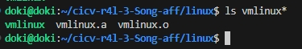
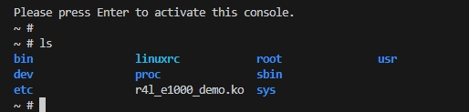
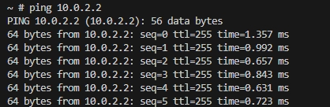
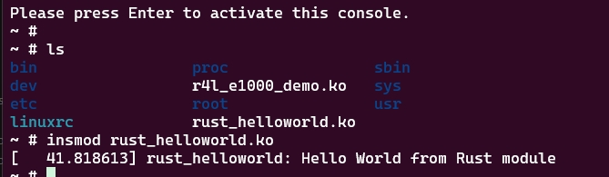

# 训练营作业
### 作业1 编译Linux内核
进入./linux文件夹，在终端中输入下列命令进行编译：
```sh
make x86_64_defconfig
make LLVM=1 menuconfig
#设置rust支持
General setup
        ---> [*] Rust support
make LLVM=1 -j$(nproc)
#查看编译结果
ls
```


### 作业2 对Linux内核进行一些配置
进入./src_e1000文件夹，执行`./build_image.sh`,进入qemu之中。

可以看到有`r4l_e1000_demo.ko`文件，通过执行下列命令：
```sh
insmod r4l_e1000_demo.ko
ip link set eth0 up
ip addr add broadcast 10.0.2.255 dev eth0
ip addr add 10.0.2.15/255.255.255.0 dev eth0 
ip route add default via 10.0.2.1
ping 10.0.2.2
```
可以正常ping通

1. 编译成内核模块，是在哪个文件中以哪条语句定义的？
位于`src_e1000/Kbuild`中的 `obj-m := r4l_e1000_demo.o`语句


2. 该模块位于独立的文件夹内，却能编译成Linux内核模块，这叫做out-of-tree module，请分析它是如何与内核代码产生联系的
？
于`src_e1000/Makefile`中定义了内核和模块的路径
```Makefile
# SPDX-License-Identifier: GPL-2.0

KDIR ?= ../linux

default:
	$(MAKE) -C $(KDIR) M=$$PWD
```
### 作业3 使用rust编写一个简单的内核模块并运行
1. 进入到Linux目录下samples/rust文件夹
2. 添加一个rust_helloworld.rs文件
3. `samples/rust/Kconfig`中增加配置
    ```
    config SAMPLE_RUST_HELLOWORLD 
    tristate "hello World" 
    help 
      hello World. 
 
      If unsure, say N. 
    
    ```
4. `samples/rust/Makefile`中增加配置
    ```
    obj-$(CONFIG_SAMPLE_RUST_HELLOWORLD)        += rust_helloworld.o 
    ```
5. 在linux目录下执行`make LLVM=1 -j$(nproc)`
6. 将模块复制到src_e1000目录下`cp ../linux/samples/rust/rust_helloworld.ko ./rootfs`
7. `insmod` 模块查看输出

